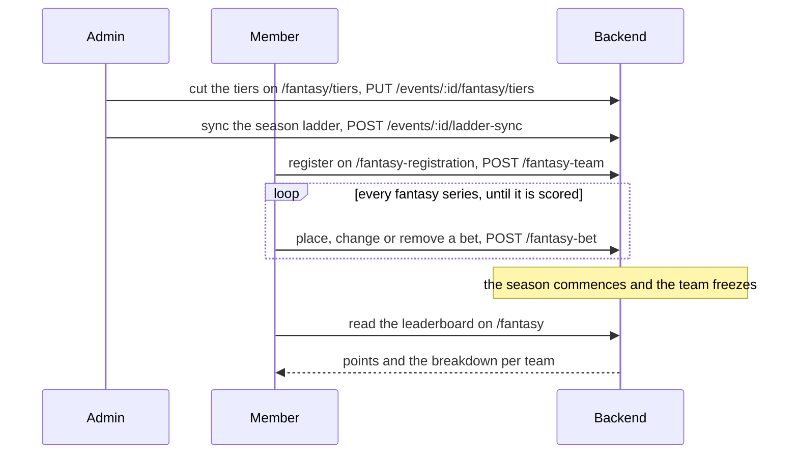

This flow runs the fantasy game of one GNL season. The admin cuts the season's players into tiers. A member then drafts a fantasy team from those tiers and bets on the season's fantasy series. The team freezes when the season commences; each bet stays open until its series is scored. The backend scores every team, and the leaderboard reads its points and breakdown.

# Steps

| Step | Who | Where | Writes | Owner |
|---|---|---|---|---|
| 1. Cut the tiers | admin | `/fantasy/tiers` | `PUT /events/{id}/fantasy/tiers`, then `POST /events/{id}/ladder-sync` | [Fantasy](../pages/fantasy.md) |
| 2. Register a fantasy team | member | `/fantasy-registration`; Home's Fantasy panel links to it | `POST /fantasy-team` | [Fantasy](../pages/fantasy.md) |
| 3. Bet on a fantasy series, change or remove the bet | member | `/fantasy-registration`, or the Fantasy panel on `/` | `POST /fantasy-bet`, `PUT /fantasy-bet/{id}`, `DELETE /fantasy-bet/{id}` | [Fantasy](../pages/fantasy.md) |
| 4. The season commences and the team freezes | the backend: the phase is computed, never stored | every fantasy page | read only | [Fantasy](../pages/fantasy.md) |
| 5. Read the leaderboard and the breakdown | member | `/fantasy` | read only | [Fantasy](../pages/fantasy.md) |

Step 3 repeats per fantasy series until that series is scored, before and after the season commences.

# Diagram

# Rules

- Registration opens while the season is open, team creation is enabled in the settings and the tiers are cut; the page names the condition that is missing: [fantasy](../pages/fantasy.md).
- Home offers "Create your fantasy team" while team creation is enabled and the member has no team, and lists the open bets once he has one: [member self-service](../pages/member.md).
- One bet dialog places, changes and deletes a bet on the fantasy page and on Home, and a bet locks once its series is scored: [fantasy](../pages/fantasy.md).
- A commenced season's tiers stay locked until an admin unlocks them: [fantasy](../pages/fantasy.md).
- An admin adds, edits and deletes any bet for a captain on `/fantasy/bets`, and any team on the leaderboard: [fantasy](../pages/fantasy.md).
