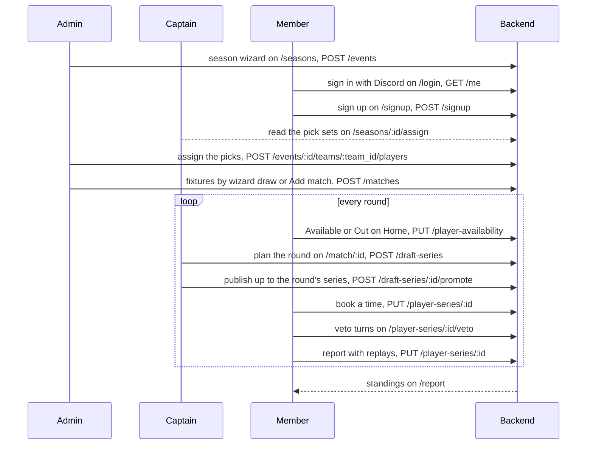

This flow follows one GNL season from the season wizard to the public standings. Three roles hand work to each other. The admin builds the season and drafts the teams. The captain plans the pairings of his team's fixture and publishes them, as an admin may. The member signs up, answers each round, and books, vetoes and reports his series. The setup runs once; the round steps run once per round.

# Steps

| Step | Who | Where | Writes | Owner |
|---|---|---|---|---|
| 1. Build the season in the wizard | admin | `/seasons` | `POST /events`, then the stages, teams, captains, rosters, matchups and maps in a fixed order | [The GNL season](../pages/gnl-season.md) |
| 2. Sign in with Discord | member | `/login` | read only (`GET /me`) | [Session and auth](../concepts/session-and-auth.md) |
| 3. Sign up for the season | member | `/signup` | `POST /signup` | [Member self-service](../pages/member.md) |
| 4. Draft the teams, one pick set at a time | admin; a captain reads | `/seasons/:id/assign` | `POST /events/{id}/teams/{team_id}/players` | [The GNL season](../pages/gnl-season.md) |
| 5. Set the fixtures: the wizard's random draw or "Add match" | admin | `/seasons`, `/seasons/:id` | `POST /matches` | [The GNL season](../pages/gnl-season.md) |
| 6. Answer the round, "Available" or "Out" | member | `/`, My Season | `PUT /player-availability` | [Member self-service](../pages/member.md) |
| 7. Plan the round: who plays, the MMR range, and the selected matchups moved into the shared draft | captain of either team, or an admin | `/match/:id`, Plan round tab | `PUT /events/{event_id}/teams/{team_id}/availability` for an own player's answer, `POST /draft-series` | [Fixtures and series](../pages/fixtures-and-series.md) |
| 8. Publish the ticked pairings, up to the round's series | captain of either team, or an admin | `/match/:id`, Plan round tab, Draft step | `POST /draft-series/{id}/promote` | [Fixtures and series](../pages/fixtures-and-series.md) |
| 9. Book a time in the schedule dialog | either side | the action bar on `/`, the player page or `/series/:id` | `PUT /player-series/{id}` with `date_time` | [Fixtures and series](../pages/fixtures-and-series.md) |
| 10. Veto the maps | both sides, in turn | `/player-series/:id/veto`, or inside Report Result | `PUT /player-series/{id}/veto` | [Fixtures and series](../pages/fixtures-and-series.md) |
| 11. Report the result, one replay per game | either side | Report Result, from the action bar | `POST /player-series/{id}/replays/{game}/upload-url`, `PUT /player-series/{id}` | [Fixtures and series](../pages/fixtures-and-series.md) |
| 12. Read the standings | anyone | `/report` | read only | [The GNL season](../pages/gnl-season.md) |

Steps 6 to 11 repeat every round. A round that holds the member's series shows the series in place of the answer, so the answer comes before the pairing.

# Diagram

# Rules

- One write takes the round answer, `PUT /player-availability`, from Home's My Season and from the owner's round cards: [member self-service](../pages/member.md), [players and stats](../pages/players-and-stats.md). A captain answers for a member of his own team on the team rounds page: [teams](../pages/teams.md).
- The draft takes any number of pairings. Either captain of the fixture, or an admin, publishes up to the round's `series_per_round`, and the backend refuses one more: [fixtures and series](../pages/fixtures-and-series.md).
- A side is acted on by the player it names, by a captain of the team that fields it, or by an admin, on the same routes: [shared components](../concepts/shared-components.md).
- The veto is entered inside Report Result, and a missing veto or replay warns and never blocks the report: [the veto decision](../decisions/veto-in-report-result.md).
