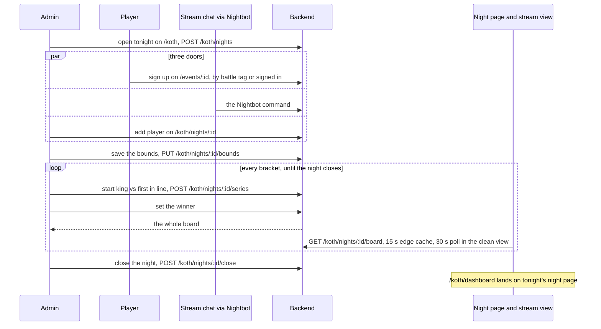

This flow runs one KOTH night. The admin opens the night, places the players in brackets, and pairs every series by hand, live: the king of a bracket against the first player in line. Players sign up through three doors. Everyone else watches one board, on the night page or in the stream view, until the admin closes the night.

# Steps

| Step | Who | Where | Writes | Owner |
|---|---|---|---|---|
| 1. Open tonight's night | admin | `/koth` | `POST /koth/nights` | [KOTH](../pages/koth.md) |
| 2. Sign up from the night page | a visitor by battle tag, or a signed-in reader, who can also withdraw | `/events/:id` | `POST /events/{id}/entrants` | [KOTH](../pages/koth.md) |
| 3. Sign up from the stream chat | a player in the chat, through Nightbot | the Nightbot command; its token is set on `/config` | the backend route the command calls | [Site admin](../pages/site-admin.md) |
| 4. Add a late arrival, place a signup with no rating, move one race to another bracket | admin | `/koth/nights/:id` | `POST /events/{id}/entrants/admin`, `PUT /events/{id}/entrants/{entrant_id}`, `PUT /koth/nights/{id}/entrants/{entrant_id}/bracket` | [KOTH](../pages/koth.md) |
| 5. Save the bracket bounds | admin | `/koth/nights/:id`, Brackets card | `PUT /koth/nights/{id}/bounds` | [KOTH](../pages/koth.md) |
| 6. Start a series: the king against the first in line | admin | `/koth/nights/:id` | `POST /koth/nights/{id}/series` | [KOTH](../pages/koth.md) |
| 7. Set the winner | admin | `/koth/nights/:id` | `PUT /koth/nights/{id}/series/{series_id}/result` | [KOTH](../pages/koth.md) |
| 8. Close the night | admin | `/koth/nights/:id` | `POST /koth/nights/{id}/close` | [KOTH](../pages/koth.md) |
| 9. Watch the board | anyone, and the stream | `/events/:id`, `/events/:id?mode=clean`, `/koth/dashboard` | read only | [KOTH](../pages/koth.md) |

Steps 6 and 7 repeat in every bracket until the night closes.

# Diagram

# Rules

- Every admin write answers the whole board, so the run page sets its state from that answer and reads nothing per row: [KOTH](../pages/koth.md).
- The public board read carries no bearer, so the edge caches it for fifteen seconds; the clean stream view reads it again every thirty seconds while the tab is visible and the night is not closed: [KOTH](../pages/koth.md), [the edge-cache pitfall](../pitfalls/edge-cache-no-bearer.md).
- The entrants page takes no division or seed write for a night, because those writes rebuild the brackets and reorder the queue; the run page moves the bounds: [event management](../pages/event-management.md).
- A king who withdraws loses a forfeit series to the first in line: [KOTH](../pages/koth.md).
- Only the close ends a night, and the standing kings start the next night as King from last event: [KOTH](../pages/koth.md).
