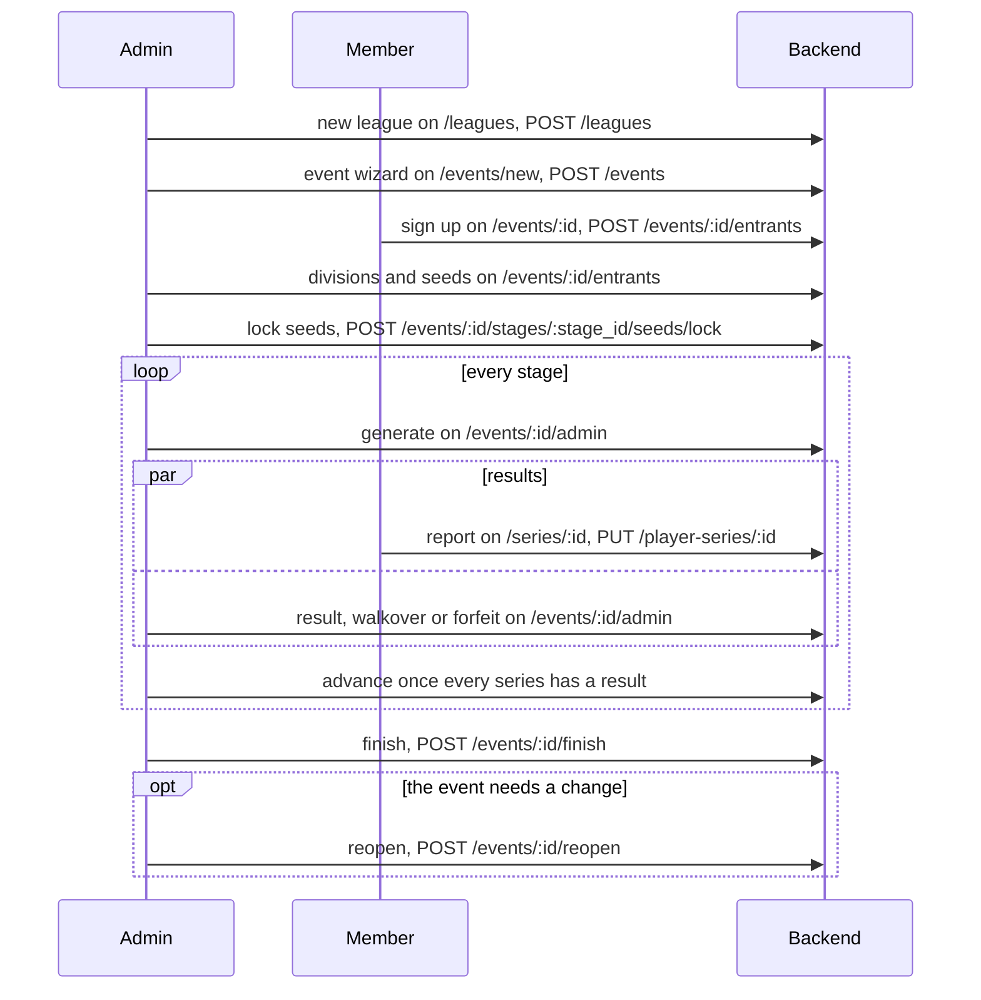

This flow takes a cup from its creation to its awards. Its runner, an admin or an organizer the cup names, drives every step but two: members sign up on the event page, and the sides of a series report its result on the series page. The stage engine pairs the series, so a cup has no draft pairing. A stage loops through generate, results and advance until the last stage finishes the event.

# Steps

| Step | Who | Where | Writes | Owner |
|---|---|---|---|---|
| 1. Make the league | admin | `/leagues` | `POST /leagues` | [Event management](../pages/event-management.md) |
| 2. Make the cup: the short way, with its best-of per bracket part and its map pool, or the five-step wizard | organizer or admin | `/events/new/cup`, or `/events/new` | `POST /events` with the stages and the pool, then for the wizard `PUT /events/{id}/divisions` | [Event management](../pages/event-management.md) |
| 3. Sign up, and check in when the event asks for it | member; an admin adds anyone by hand on `/events/:id/entrants` | `/events/:id`, the signup dialog | `POST /events/{id}/entrants`, `POST /events/{id}/entrants/{entrant_id}/checkin` | [Leagues and events](../pages/leagues-and-events.md) |
| 4. Cut the divisions and set the seeds | admin | `/events/:id/entrants` | `PUT /events/{id}/divisions`, `POST /events/{id}/divisions/assign`, `PUT /events/{id}/stages/{stage_id}/seeds` | [Event management](../pages/event-management.md) |
| 5. Lock the seeds | admin | `/events/:id/entrants` | `POST /events/{id}/stages/{stage_id}/seeds/lock` | [Event management](../pages/event-management.md) |
| 6. Generate the stage | admin | `/events/:id/admin` | `POST /events/{id}/stages/{stage_id}/generate`; a Swiss stage draws each round with `POST /events/{id}/stages/{stage_id}/rounds` | [Event management](../pages/event-management.md) |
| 6a. Undo the draw, or swap a player who has not played | organizer or admin | `/events/:id/admin`, Draw and Participants | `DELETE /events/{id}/stages/{stage_id}/series`, `POST /events/{id}/entrants/{entrant_id}/replace` | [Event management](../pages/event-management.md) |
| 7. Report a result | either side of the series | `/series/:id`, Report Result | `PUT /player-series/{id}` | [Fixtures and series](../pages/fixtures-and-series.md) |
| 8. Enter a result, a walkover or a forfeit | admin | `/events/:id/admin`, the result dialog | `PUT /series/{id}`, `PUT /series/{id}/result-kind`, `PUT /series/{id}/places` for a lobby | [Event management](../pages/event-management.md) |
| 9. Advance the stage, on a stage another stage follows | admin | `/events/:id/admin` | `POST /events/{id}/stages/{stage_id}/advance` | [Event management](../pages/event-management.md) |
| 10. Finish the event, or reopen a finished one | admin | `/events/:id/admin`, the last stage | `POST /events/{id}/finish`, `POST /events/{id}/reopen` | [Event management](../pages/event-management.md) |

Steps 6 to 9 repeat for every stage. A cup plays one stage, so it skips step 9 and finishes.

# Diagram

# Rules

- "Create event" writes the event and its stages in one body, so no event exists without its stages: [event management](../pages/event-management.md).
- The eligibility warnings show as chips after a signup and never block it: [leagues and events](../pages/leagues-and-events.md).
- A locked stage takes no reorder, and the public page shows the seeds once they are locked: [event management](../pages/event-management.md).
- "Advance" waits until every series of the stage carries a result, and the last stage never shows it. A reopen of a series that the engine refuses asks once more and forces: [event management](../pages/event-management.md).
- "Finish" freezes the last stage's table into the award rows, and a first place reaches the player page's trophy shelf: [event management](../pages/event-management.md).
