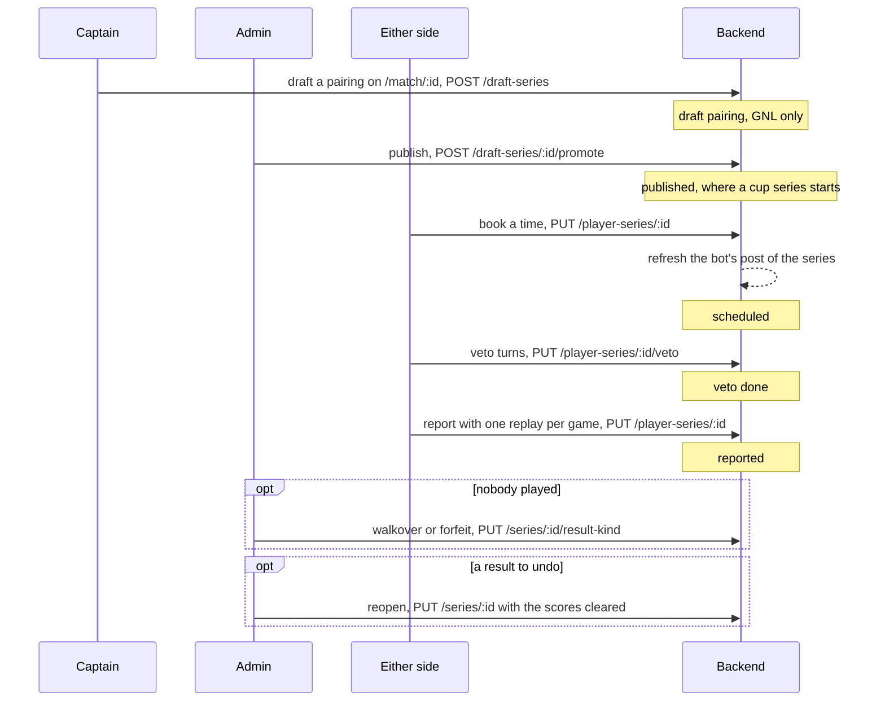

This flow follows one series through its states: draft pairing, published, scheduled, veto done and reported. A draft pairing exists on a GNL fixture alone; a cup series starts at published, because the stage engine generates it. The sides move the series forward. An admin may also act for either side, and only an admin publishes, awards a walkover or a forfeit, and reopens a result.

# Steps

| Step | Who | Where | Writes | Owner |
|---|---|---|---|---|
| 1. Draft a pairing (GNL only) | captain of either team, or an admin | `/match/:id`, Draft tab | `POST /draft-series` | [Fixtures and series](../pages/fixtures-and-series.md) |
| 2. Publish the pairing | admin | `/match/:id`, Draft tab | `POST /draft-series/{id}/promote` | [Fixtures and series](../pages/fixtures-and-series.md) |
| 2a. Or, for a cup, generate the stage | admin | `/events/:id/admin` | `POST /events/{id}/stages/{stage_id}/generate` | [Event management](../pages/event-management.md) |
| 3. Book a time | the player a side names, a captain of the team that fields it, or an admin | the schedule dialog, from the action bar on `/`, the player page or `/series/:id` | `PUT /player-series/{id}` with `date_time` | [Fixtures and series](../pages/fixtures-and-series.md) |
| 4. Take the veto turns | both sides, in turn; an admin edits either side | `/player-series/:id/veto`, or inside Report Result | `PUT /player-series/{id}/veto` | [Fixtures and series](../pages/fixtures-and-series.md) |
| 5. Report the result with one replay per game | either side, or an admin | Report Result, from the action bar | `POST /player-series/{id}/replays/{game}/upload-url`, `PUT /player-series/{id}` | [Fixtures and series](../pages/fixtures-and-series.md) |
| 6. Award a walkover or a forfeit | admin | `/series/:id`, or `/events/:id/admin` | `PUT /series/{id}/result-kind` | [Fixtures and series](../pages/fixtures-and-series.md) |
| 7. Reopen a result | admin | `/events/:id/admin`, or the series edit on `/match/:id` | `PUT /series/{id}` with the scores cleared, and `?force=true` after a refusal | [Event management](../pages/event-management.md) |

# Diagram

# Rules

- An admin books a time on the same player route as a side, so every schedule write refreshes the bot's post of the series: [the series action bar](../concepts/shared-components.md), [fixtures and series](../pages/fixtures-and-series.md).
- No state is a gate. A series whose rules play no veto skips that step, and a series whose booked time has passed asks for the result next: [the series action bar](../concepts/shared-components.md).
- The veto is entered inside Report Result. A missing veto, a missing replay or a replay on another map warns, asks once, and still saves: [the veto decision](../decisions/veto-in-report-result.md), [fixtures and series](../pages/fixtures-and-series.md).
- A published series with no result and no replay can be replaced: a draft names it, and "Publish and replace" names the booked time and the veto the replaced series loses: [fixtures and series](../pages/fixtures-and-series.md).
- A reopen the engine refuses, because a later series already carries a result, asks once more before it forces: [event management](../pages/event-management.md).
