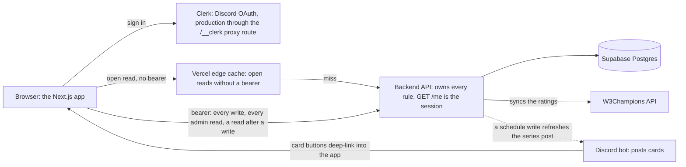

# What it is

One app for everyone: the public event and series pages, a member's profile, signup, availability, team, series reporting and fantasy pages, a captain's draft pages, and the admin pages for events, seasons, maps, config, Discord roles and KOTH nights. It draws nothing of its own data; every number comes from the backend API, and the backend's `/me` answer decides what the app shows.

# Where it runs

| Target | What |
|---|---|
| production | Vercel project `wc3-gym-frontend`, built from the `release` branch, which a GitHub Release moves to a commit on `main`; Clerk production instance in proxy mode |
| staging | the preview of `main`, built on every merge, on the Clerk dev instance and pointed at the staging backend |
| other branches | no deployment from a push; a preview exists when someone makes one by hand, on the Clerk dev instance and pointed at the staging backend |
| local | `pnpm dev` in `next/` on port 3000, with `PROXY_TARGET` naming the backend that `/api` reaches |

# The system in one picture



Two request paths leave the browser. An open read listed in `EDGE_CACHED` leaves without a bearer for a non-admin, so the Vercel edge can answer it from its cache. Every write, every admin read and a read right after a write carries the bearer and reaches the backend. [Read cost and the edge cache](concepts/backend-contract.md#read-cost-and-the-edge-cache) lists the rules.

# Layout

```
next/                the app; every command runs from here
  next.config.ts     the dev proxy for /api, the /__clerk rewrite, one redirect
  vercel.json        which branches deploy and when a build is skipped
  src/app/           layout.tsx (fonts, the palette, Clerk), globals.css, the Clerk proxy route
  src/app/(app)/     one folder per route: page.tsx and the view it draws
  src/components/    the shared pieces; ui/ holds the shadcn/ui kit, layout/ the app shell
  src/stores/        one module per area, all fetches
  src/lib/           the route table, the guard, the Clerk bridge
  src/hooks/         theme, breakpoint, player panel, delete dialog
  src/helpers/       fetch wrapper, backend URL, and the pure .mjs rules with tests
  src/assets/        race icons, media, the Discord mark
DESIGN.md            every colour token, the type, the casing rules, the shared components, the events vocabulary, the known gaps
ADMIN_UI_USER_GUIDE.md  the admin guide, also served at /user-guide
```

# Start here

1. [App shell and routing](concepts/app-shell-and-routing.md), [session and auth](concepts/session-and-auth.md).
2. [The backend contract as consumed here](concepts/backend-contract.md), [stores](concepts/stores.md).
3. `DESIGN.md` in full, then [shared components](concepts/shared-components.md).
4. The [pages](pages/index.md): what each page area does, who may do it, and the routes it writes. Start with [event management](pages/event-management.md).
5. [Run locally](runbooks/run-locally.md), [testing](conventions/testing.md), [git and pull requests](conventions/git-and-pull-requests.md).
6. Before a change: the [decisions](decisions/index.md) and the [pitfalls](pitfalls/index.md).
